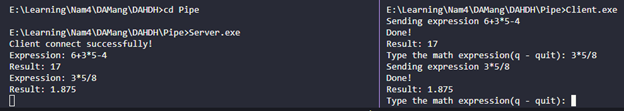
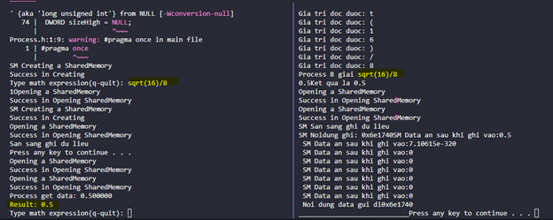

## Topic
Study about Pipe and Shared Memory to communicate processes in a scoop. In this topic, I coded with VS Code on Windows.

## Installation
Test Pipe with the following command:
```
>g++ MyStack.h MyStack.cpp Evaluate.h Evaluate.cpp  Pipe/Server.cpp -o Pipe/Server && cd Pipe && Server.exe

>cd Client
>g++ Client.cpp -o Client && Client.exe
```
Test shared memory with the following command:
```
>g++ _Memory.h _Memory.cpp SharedMemory.h SharedMemory.cpp Process.h Process.cpp ProcessA.cpp -o ProcessA && ProcessA.exe


>g++ MyStack.h MyStack.cpp Evaluate.h Evaluate.cpp _Memory.h _Memory.cpp SharedMemory.h SharedMemory.cpp Process.h Process.cpp ProcessB.h ProcessB.cpp -o ProcessB && ProcessB.exe
```

## Result
### Pipe

### Shared Memory



Thanks for reading!

